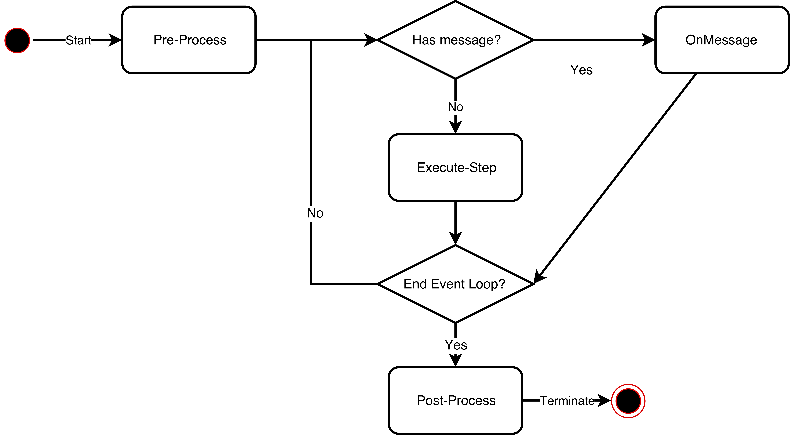

# Introduction
This is an actor pattern implementation by MPI. A demonstration is provided to show the usage of this framework.

# Squirrel Problem Demo
## Introduction
The specification of the demonstration can be found on [here](doc/squirrel_demo.pdf). It intends to simulate the affect of squirrel parapoxvirus through time.

## Build
The program is compiled using gcc version 4.8.5 with GNU99 as the standard.

To build the program, firstly you need to clone this repository into your work space.

	git clone https://github.com/Yiiinsh/MPI-Actor

Then you can change to the directory, build the program by typing the following commands:

	cd MPI-Actor
	make

If you have successfully built up the project, you will get the executable named demo in your current directory. To execute this program on the work space, type the commands:

	mpirun -n 250 ./demo

If you would like to submit your program to run on the backend of Cirrus, we have provided a pbs script, you can do it with:

	qsub demo.pbs

## Implementation
Actor pattern is used to parallelize the solution. In this case, we maintain three major actors: Clock actor, Landcell actor and Squirrel actor. The structure of this program is presented below:

### Clock Actor
Clock actor serve as the global time manager in the system. It accounts for the maintenance of global time. It will query the landcell about the metrics every simulated month and print out the result. The clock actor will abort the simulation after it meets the termination criterias.

### Landcell Actor
Landcell actor simulates the lands to host squirrels. It will receive hop message from squirrels, maintain corresponding metrics and send the metrics to the clock after query on every month.

### Squirrel Actor
Squirrel actor is the entity for squirrels. It will keep hopping without concern about time. It will catch disease, give birth to other squirrels and die after it met specified conditions.

## Results
The execution result with suggested configurations can be seen on [results](doc/results).

# MPI-Actor Framework
## Introduction
This framework is implemented in "one actor per process" pattern. All processes are maintained in a process pool and users can apply this framework to solve specified problem by implementing their own actors.

## Design
Definition of actors in this project can be abstracted as:

	typedef struct __actor
	{
    	char type[ACTOR_TYPE_NAME_LIMIT];
    	bool event_loop;

    	void (*on_message)(struct __actor *self, MPI_Status *status);
    	void (*execute_step)(struct __actor *self, int argc, char 	**argv);
    	void (*new_actor)(struct __actor *self, char *type, int count);
    	void (*pre_process)(struct __actor *self);
    	void (*post_process)(struct __actor *self);
    	void (*terminate)(struct __actor *self);
	} ACTOR;

Actors in this framework has the lifecycle as:

Users can design and implement their own actors with provided lifecycle hookers on different lifecycle stage.

Generally, the main framework runs in this way:

    statusCode = processPoolInit();
    if (2 == statusCode) /* Master actor */
    {
        create_main_actor(&actor);
        actor_start(&actor);
    }
    else if (1 == statusCode) /* Worker Actor */
    {
        // Recv actor type
        char type[ACTOR_TYPE_NAME_LIMIT];
        memset(type, '\0', ACTOR_TYPE_NAME_LIMIT);
        MPI_Recv(type, ACTOR_TYPE_NAME_LIMIT, MPI_CHAR, RANK_MAIN_ACTOR, ACTOR_CREATE_TAG, MPI_COMM_WORLD, MPI_STATUS_IGNORE);
        
        // create actor and start
        create_actor(type, &actor);
        actor_start(&actor);
    }

The process on Rank 0 are treated as the master of this pool, which is responsible for the allocation & deallocation of actors. A template for main actor is provided and users can further customized it on the pre-process stage to do some set up works for the application. After completion of all the set up works, the master will only serve as the pool master and wait for further commands about the pool:

    int main_actor_status = masterPoll();
    while (main_actor_status)
    {
        main_actor_status = masterPoll();
    }

Do not alter the main actor part except for the pre-process stage unless you have fully understand what is going on with the framework.

## Usage
The main entry of the application are provided in the framework. For a better usage of this framework, there are some best practice to follow:

* Understand the requirements and design corresponding actors
* Implement those actors in the fromat defined in __actor.h__
* Modify the __main_actor_template.h__, customize the pre-process function to set up system environments ( initialize origianl actors )
* Implement the interface declared in __customized_actors.h__, it is a guidance to the framework about how to create new actors
* Write a corresponding Makefile for the solution
* Build up the project and run it, it is users' responsibility to ensure that enough processes have been allocated for MPI
